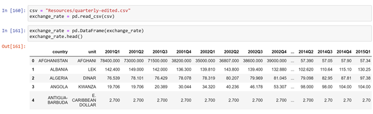
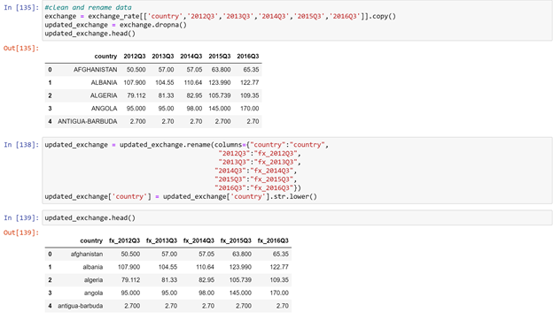

<!-- PROJECT LOGO -->
 

    
  <h3 align="center">ETL Project</h3>

## About The Project
The project is to...
  
## Built With
* [Python Pandas](https://pandas.pydata.org/) 
* [Python SQLAlchemy](https://www.sqlalchemy.org/) 
* [PostgreSQL](https://www.postgresql.org/) 

## Data Sources
* [Finnhub](https://finnhub.io/docs/api#country) - Country
* [data.world](https://data.world/associatedpress/foreign-exchange-rates) - Forex
* [Kaggle](https://www.kaggle.com/tanuprabhu/population-by-country-2020?select=population_by_country_2020.csv) - Population
* [World Bank](https://data.worldbank.org/indicator/FP.CPI.TOTL.ZG?end=2019&start=2019&view=bar) - Inflation

## Extraction (E)
The report is to utilize different data types; therefore, first I found country list as one of my dependency. Country list was found at [Finnhub](https://finnhub.io/) that I was getting API key on the website to read data. Following I found population, forex and inflation data which are CSV, CSV, and Excel files. I aimed to merge by chosen same period (from 2012 to 2015) to compare reasonably.   

## Transformation (T)
This step is to import data, select columns needed, and clean/organize data. I unified “country” under lower cases for better merging on the next step. 
* Import and convert data into DataFrame

* Clean data (select, rename columns and unify “country” under lower case) 

## Created by 
Yi An Pan (Emma)
* [Linkedin](https://www.linkedin.com/in/emmayianpan/) 
* [GitHub](https://github.com/emmayianpan)
